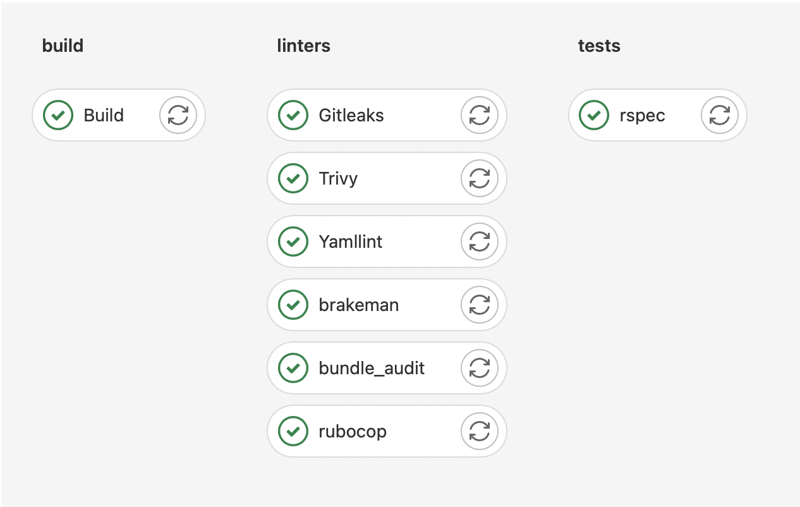
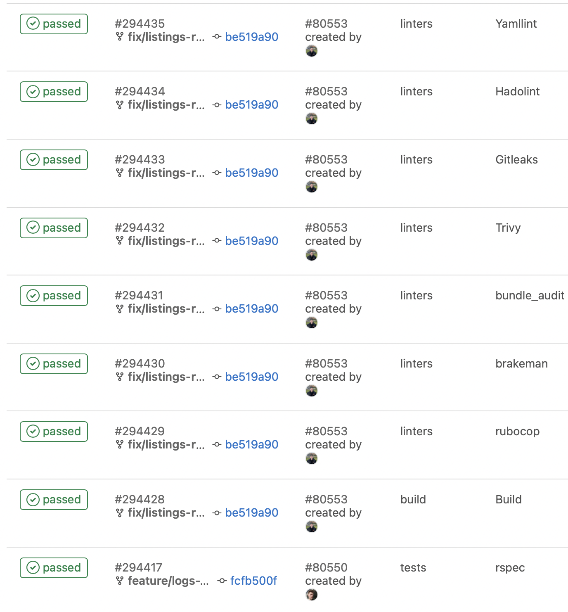

<h1 align="center">GitLab CI for Rails </h1>


GitLab CI/CD is GitLab’s built-in tool for software development using continuous methodology:

Continuous integration (CI).
Continuous delivery and deployment (CD).

[Gitlab Documentation](https://docs.gitlab.com/ee/ci)

## Configure the project

GitLab CI/CD pipelines are configured using a YAML file called .gitlab-ci.yml within each project. The .gitlab-ci.yml file defines the structure and order of the pipelines and determines:
This is what the .gitlab-ci.yml file looks like for this project:

### Creating a .gitlab-ci.yml file

The .gitlab-ci.yml file is where you configure what CI does with your project. It lives in the root of your repository.

On any push to your repository, GitLab will look for the .gitlab-ci.yml file and start jobs on Runners according to the contents of the file, for that commit.

```yaml


stages:
  - build 
  # running build 
  - linters
  # running code quality tools (rubocop, brakeman)
  - tests
  # running tests
  - scanners 
  # image and application scanning
  - deploy
  # application deployment

# All variables you will set up in your repo settings (Settings->CI/CD->Variables)
variables:
  RAILS_MASTER_KEY: $RAILS_MASTER_KEY
  AWS_REGISTRY_URL: $AWS_REGISTRY_URL
  AWS_REGION: $AWS_REGION
  REGISTRY_IMAGE: $AWS_REGISTRY_URL:$CI_COMMIT_REF_SLUG
  REGISTRY_IMAGE_PRODUCTION: $AWS_REGISTRY_URL_PRODUCTION:$CI_COMMIT_REF_SLUG
  ECS_CLUSTER_STAGING: $ECS_CLUSTER_STAGING
  ECS_CLUSTER_PRODUCTION: $ECS_CLUSTER_PRODUCTION
  ECS_SERVICE_STAGING: $ECS_SERVICE_STAGING
  GITLEAKS_CONFIG: gitleaks.toml
  DOCKER_DRIVER: overlay2
  SENTRY_AUTH_TOKEN: $SENTRY_AUTH_TOKEN
  SENTRY_ORG: $SENTRY_ORG
  SENTRY_PROJECT: $SENTRY_PROJECT


# Perform private ECR registry authentication
.registry_auth: &registry_auth
  image: public.ecr.aws/o0j8c5i3/codica:registry-auth-leaks
  before_script:
    - aws ecr get-login-password --region $AWS_REGION | docker login -u AWS --password-stdin $AWS_REGISTRY_URL


# Rubocop linter
rubocop:
  stage: linters
  needs: [Build]
  image: $REGISTRY_IMAGE_ID
  except:
    - master
  script:
    - bundle exec rubocop


# Brakeman linter
brakeman:
  stage: linters
  needs: [Build]
  image: $REGISTRY_IMAGE_ID
  except:
    - master
  script:
    - brakeman
  

# Bundle audit
bundle_audit:
  stage: linters
  needs: [Build]
  image: $REGISTRY_IMAGE_ID
  except:
    - master
  script:
    - bundle exec bundle-audit


# Trivy to scan image vulnerabilities
Trivy:
  stage: linters
  allow_failure: true
  image:
    name: aquasec/trivy:0.31.3
    entrypoint: [""]
  needs: [Build]
  except:
    - main
  script:
    - trivy image --security-checks vuln $REGISTRY_IMAGE_ID


# Gitleaks to detect credentials leak
Gitleaks:
  <<: *registry_auth
  stage: linters
  allow_failure: true
  needs: []
  except:
    - main
    - master
  script:
    - gitleaks detect --verbose --no-git | jq -r '["Description:", .Description], ["File:", .File], ["Line:", .StartLine, "Column:", .StartColumn, "--------------"]' | tr -d '[],""'


# Hadolint to check dockerfiles syntax
Hadolint:
  needs: []
  image: hadolint/hadolint:latest-debian
  stage: scanners
  allow_failure: false
  script:
    - hadolint Dockerfile
    - hadolint Dockerfile.dev
  rules: 
    - if: '$CI_PIPELINE_SOURCE == "merge_request_event"'
      when: never
    - changes: 
        - Dockerfile*


# Yamllint to check yaml files syntax
Yamllint:
  needs: []
  image:
    name: public.ecr.aws/**/codica:yamllint
    entrypoint: [""]
  stage: scanners
  allow_failure: false
  script:
    - rm -rf spec
    - yamllint .
  rules:
    - if: '$CI_PIPELINE_SOURCE == "merge_request_event"'
      when: never
    - changes:
        - "**/*.yml"
        - "**/*.yaml"


# Rspec tests
rspec:
  stage: tests
  image: $REGISTRY_IMAGE
  needs: [Build | Staging]
  variables:
    DB_HOST: postgres
    DB_USERNAME: postgres
    DB_PASSWORD: $DB_PASSWORD
    DB_PORT: 5432
    REDIS_URL: "redis://redis:6379"
  script:
    - bundle exec rails db:migrate RAILS_ENV=test
    - bundle exec rspec
  except:
    - master


# We use Kaniko as main image builder
Build:
  stage: build
  image:
    name: gcr.io/kaniko-project/executor:debug
    entrypoint: [""]
  except: 
    - master
  before_script: 
    - mkdir -p /kaniko/.docker
    - echo "{\"credHelpers\":{\"$AWS_REGISTRY_URL\":\"ecr-login\"}}" > /kaniko/.docker/config.json
  script:
    - /kaniko/executor --destination "${REGISTRY_IMAGE}"  
       --build-arg RAILS_MASTER_KEY=${RAILS_MASTER_KEY}  # if we need to use RAILS_MASTER_KEY to build our app
       --context "${CI_PROJECT_DIR}"
       --dockerfile "${CI_PROJECT_DIR}/Dockerfile"


# Deploy application to staging or production environment 
Deploy:
  stage: deploy
  variables:
    ASG_NAME: $ASG_STAGE
    CLUSTER_NAME: $ECS_CLUSTER_STAGING
    SERVICE_NAME: $SERVICE_STAGING
    AWS_REGION: $AWS_REGION
    REGISTRY_IMAGE: $REGISTRY_IMAGE_ID
  only:
    - develop
  <<: *registry_auth
  script:
    - aws ecs update-service --cluster $ECS_CLUSTER_STAGING --service $ECS_SERVICE_STAGING --force-new-deployment
    # We use sentry to push our release to our sentry account
    - VERSION=$(sentry-cli releases propose-version) && sentry-cli releases -o $SENTRY_ORG new -p $SENTRY_PROJECT $VERSION
    - sentry-cli releases -o $SENTRY_ORG -p $SENTRY_PROJECT --auth-token $SENTRY_AUTH_TOKEN set-commits --auto $VERSION
  environment:
    name: Staging
```

### Push .gitlab-ci.yml to GitLab

Once you’ve created .gitlab-ci.yml, you should add it to your Git repository and push it to GitLab.

```
git add .gitlab-ci.yml
git commit -m "Add .gitlab-ci.yml"
git push origin master
```

### Configuring a Runner

In GitLab, Runners run the jobs that you define in .gitlab-ci.yml. A Runner can be a virtual machine, a VPS, a bare-metal machine, a docker container or even a cluster of containers. GitLab and the Runners communicate through an API, so the only requirement is that the Runner’s machine has network access to the GitLab server.

A Runner can be specific to a certain project or serve multiple projects in GitLab. If it serves all projects it’s called a Shared Runner.

Find more information about different [Runners](https://docs.gitlab.com/ee/ci/runners/README.html) in the Runners documentation.

## Regular pipeline graphs

Regular pipeline graphs show the names of the jobs of each stage. Regular pipeline graphs can be found when you are on a single pipeline page. For example:


## Status of your pipeline and jobs

After configuring the Runner successfully, you should see the status of your last commit change from pending to either running, success or failed.



By clicking on a job’s status, you will be able to see the log of that job. This is important to diagnose why a job failed or acted differently than you expected.


## Examples

Visit the [examples README](https://docs.gitlab.com/ee/ci/examples/README.html) to see a list of examples using GitLab CI with various languages.

## License

Copyright © 2015-2022 Codica. It is released under the [MIT License](https://opensource.org/licenses/MIT).

## About Codica

[](https://www.codica.com)

The names and logos for Codica are trademarks of Codica.

We love open source software! See [our other projects](https://github.com/codica2) or [hire us](https://www.codica.com/) to design, develop, and grow your product.
