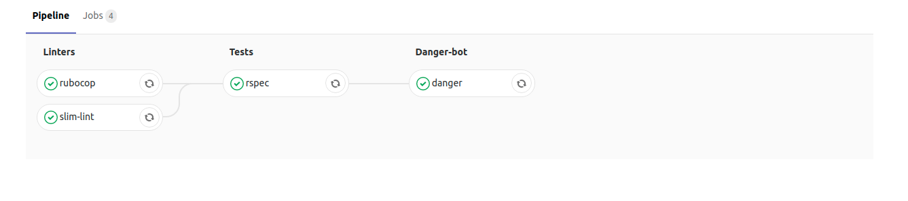
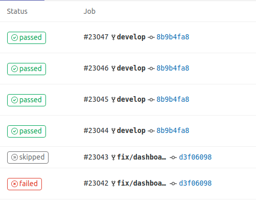
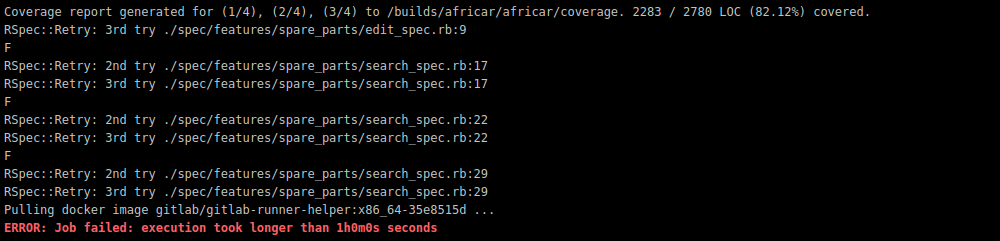

<h1 align="center">GitLab CI for Rails </h1>


GitLab CI/CD is GitLab’s built-in tool for software development using continuous methodology:

Continuous integration (CI).
Continuous delivery and deployment (CD).


[Gitlab Documentation](https://docs.gitlab.com/ee/ci)

## Configure the project
GitLab CI/CD pipelines are configured using a YAML file called .gitlab-ci.yml within each project. The .gitlab-ci.yml file defines the structure and order of the pipelines and determines:
This is what the .gitlab-ci.yml file looks like for this project:

### Creating a .gitlab-ci.yml file

The .gitlab-ci.yml file is where you configure what CI does with your project. It lives in the root of your repository.

On any push to your repository, GitLab will look for the .gitlab-ci.yml file and start jobs on Runners according to the contents of the file, for that commit.

```yaml
image: gitlab.codica.com:1234/project/project-image:build-1.4

stages:
  - linters
  - tests
  - danger-bot

services:
  - postgres:latest
  - redis:latest

cache:
  key: ${CI_COMMIT_REF_SLUG}
  paths:
  - vendor/bundle
  - node_modules/

variables:
  POSTGRES_DB: test
  POSTGRES_USER: postgres
  POSTGRES_PASSWORD: ""
  POSTGRES_HOST: postgres
  DANGER_GITLAB_API_TOKEN: YOUR_DANGER_GITLAB_API_TOKEN
  DANGER_GITLAB_HOST: gitlab.codica.com
  DANGER_GITLAB_API_BASE_URL: https://gitlab.codica.com/api/v4
  RAILS_ENV: test

before_script:
  - bundle check || bundle install --jobs $(nproc)

rubocop:
  stage: linters
  script:
  - bundle exec rubocop

slim-lint:
  stage: linters
  script:
  - slim-lint app/views/

scss-lint:
 stage: linters
 script:
 - bundle exec scss-lint

rspec:
  stage: tests
  script:
  - cp bin/ci/.env.ci .env
  - cp bin/ci/database.gitlab-ci.yml config/database.yml
  - bundle exec rake parallel:create parallel:load_schema
  - bundle exec rake parallel:spec
  artifacts:
    when: always
    paths:
      - tmp/capybara/
      - coverage/
      - log/
    expire_in: 3 hours

danger:
  stage: danger-bot
  script:
  - bundle exec danger
```
* `image` is our docker build for ci running
* `stages` steps to execute our CI
  * linters - for running code quality tools (rubocop, slim-lint)
  * tests - for running rspec
  * danger-bot - for checking conventions surrounding code review
* `services` - define what docker containers should be linked with your base image
* `cache` - when developing software depends on other libraries which are fetched via the internet during build time it’s shared between pipelines and jobs
* `before_script` - is used to define the command that should be run before all jobs, including deploy jobs, but after the restoration of artifacts. This can be an array or a multi-line string.
* `rubocop, scss-lint, rspec, danger` - jobs to be executed during ci
 
### Push .gitlab-ci.yml to GitLab

Once you’ve created .gitlab-ci.yml, you should add it to your Git repository and push it to GitLab.

```
git add .gitlab-ci.yml
git commit -m "Add .gitlab-ci.yml"
git push origin master
```

### Configuring a Runner

In GitLab, Runners run the jobs that you define in .gitlab-ci.yml. A Runner can be a virtual machine, a VPS, a bare-metal machine, a docker container or even a cluster of containers. GitLab and the Runners communicate through an API, so the only requirement is that the Runner’s machine has network access to the GitLab server.

A Runner can be specific to a certain project or serve multiple projects in GitLab. If it serves all projects it’s called a Shared Runner.

Find more information about different [Runners](https://docs.gitlab.com/ee/ci/runners/README.html) in the Runners documentation.

## Regular pipeline graphs
Regular pipeline graphs show the names of the jobs of each stage. Regular pipeline graphs can be found when you are on a single pipeline page. For example:


## Status of your pipeline and jobs

After configuring the Runner successfully, you should see the status of your last commit change from pending to either running, success or failed.



By clicking on a job’s status, you will be able to see the log of that job. This is important to diagnose why a job failed or acted differently than you expected.



## Examples

Visit the [examples README](https://docs.gitlab.com/ee/ci/examples/README.html) to see a list of examples using GitLab CI with various languages.


## License
Copyright © 2015-2019 Codica. It is released under the [MIT License](https://opensource.org/licenses/MIT).

## About Codica

[](https://www.codica.com)

The names and logos for Codica are trademarks of Codica.

We love open source software! See [our other projects](https://github.com/codica2) or [hire us](https://www.codica.com/) to design, develop, and grow your product.